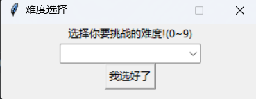
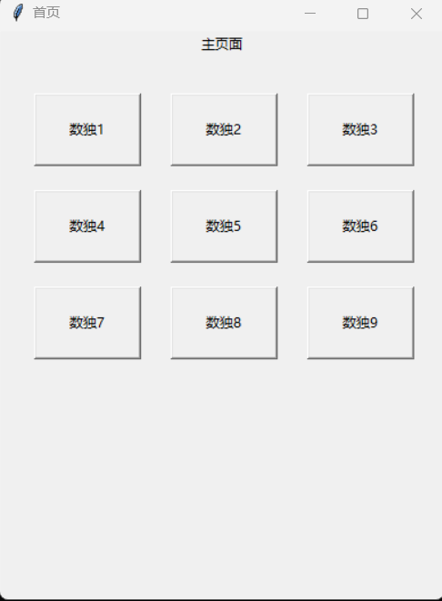
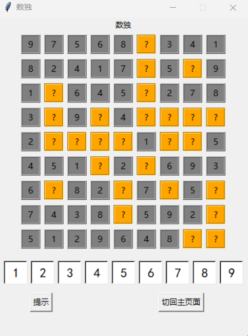

# Sudoku使用指南！！！
首先会来到开始界面，这里一共有10个难度可供选择，可是我们建议还是选择1-3，这样子才比较具备可解性

点击"我选好了"就会来到游戏的主界面，9款数独任君选择，点击游戏即可进入界面开始解题

接下来我们点击数独1来开始我们的数独之旅，进入数独界面，你需要通过点击空位来锁定目标，在下方选择数字填入，我们的数独也是非常友好，你无法填入错误的答案，填入会先闪烁红色来提醒你答题错误，要是你为解题犯难，那你也可以选择我们的提示按键，它可以提示你所选的空格的答案哦

最后你可以通过点击返回主界面的按键回到主界面，要是想退出游戏，把主界面关闭其余界面也都会关闭