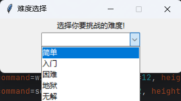
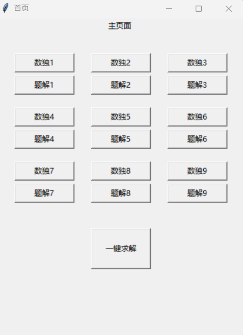
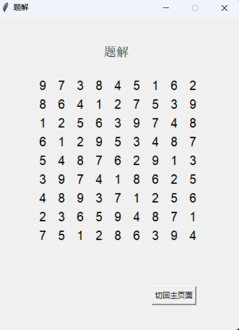
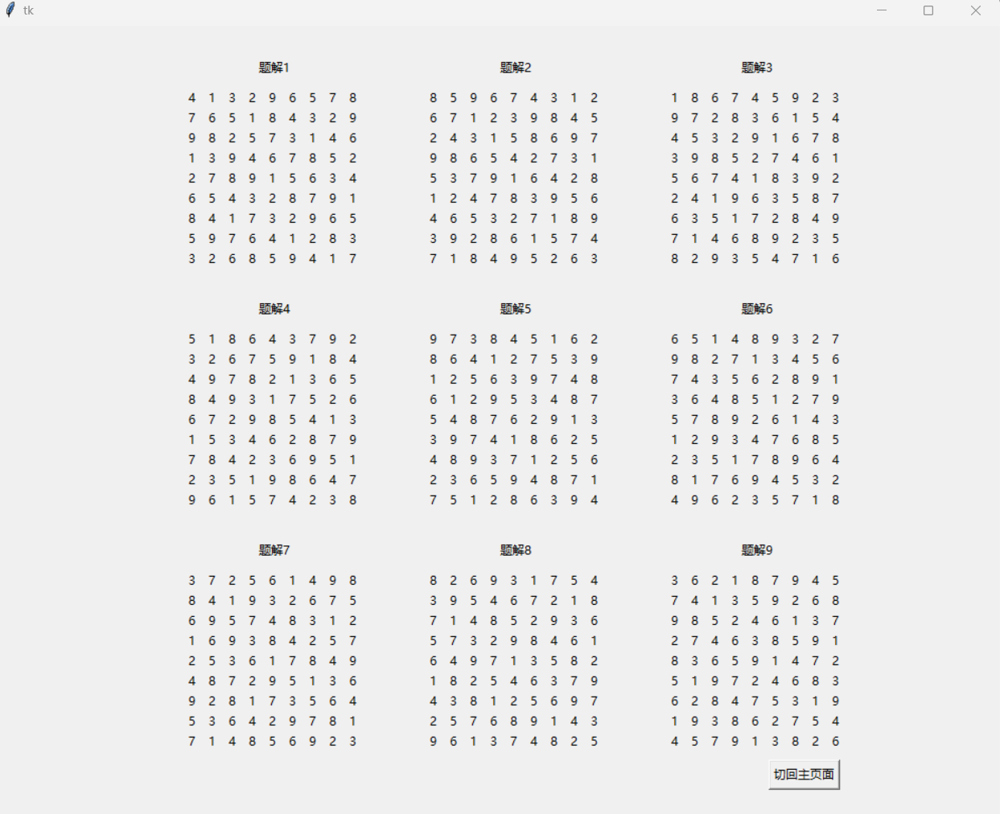
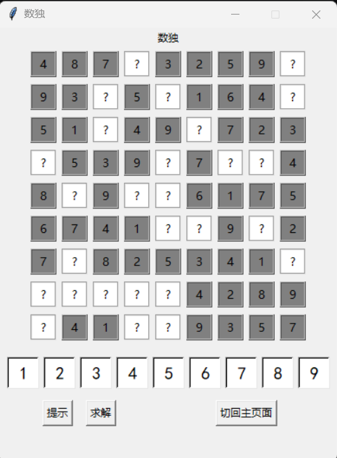

# 数独2.0！

### 难度选择
首先来到我们的难度选择界面，这次我们将之前的选项进行了升级，变成了更形象的选择

### 主界面
我们的主界面也迎来了一次升级，新增了题解的元素，这样你可以更方便的查阅题目的答案

### 子界面

点击题解[x]，你就可以进入对应数独的题解界面啦

当然，细心的我们考虑到了你可能不满足于一个一个的查看题解，我们也提供 一键求解 功能，以便于你对9个数独题解的查阅

对了，对于解答界面我们也进行小小的优化升级，当你不想在进行答题时，你可以选择 求解 按钮，他将会自动帮你把数独给填补完成哦

最后，我们在提示功能也进行了小小的升级，当你点击提示时，它将不再闪烁，我们会为你把空填上，从而避免了烦人的填写功能

### 这次的更新就到此为此啦